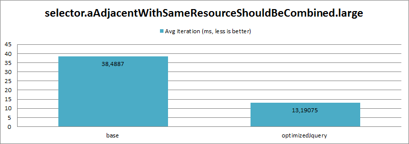

# Quail optimization

> Note: This is still work in progress. 

This document will highlight benefits of reducing jQuery.

When we started to work on optimizations we've saw following opportunities:

* reducing library size,
* improving performance,
* reducing dependencies

Additionally during that process it gave us chance to review some code out there. Most of them were performance-related as it turns that Quail had multiple places that causes it to run very slow.

## Overview

A brief overview of our update process.

We intended to work on the jQuery thing straightaway but it turned out that we need to put some effort into optimizing Quail itself. The reason for this is that Quail takes a pretty long time to check rich content of a moderate length. In this case our changes would not show a _big difference_, because getting from `16.1s` down to `15.4s` would not be impressive, while getting from `4.0s` down to `3.3s` is way more like it.

So first thing was to spot and improve the biggest bottlenecks within Quail without changing its functionality. That's when we came with the first step - _optimized_ build (you can read more about it in the "Conventional Performance Tuning" section).

Then we could progress with dropping jQuery. We realized that it's going to be a very tough task, to just remove it completely - so we decided to make smaller, and smaller builds of jQuery - to reduce its size as much as possible.

As such, we started by removing some jQuery functions and replacing them with standard DOM equivalents. Currently we're still working on improving this aspect.

## Size

When we started the work we decided to erase jQuery in a step-by-step process. First instead of completely removing jQuery we used its builder to generate build without some modules. This resulted with a jQuery dropping following modules:

`-ajax,-ajax/xhr,-ajax/script,-ajax/jsonp,-deprecated,-effects,-event,-event/alias,-wrap,-exports/amd,-sizzle`

This gave us minified `jquery.js` with a size of `46,2KB` (16,4KB gzipped) instead of `82,3KB` (28,8KB gzipped). Ratio 56%

 

## Conventional Performance Tuning

If we want jQuery performance boosts to be visible we need to improve **Quail itself**, as there were a few spots that were causing notable performance problems.

### Scope of Enhancement

* There were a few abuses of JavaScript dynamical nature, causing JS optimizers bailout. There were multiple instances of it, however we've fixed only one that had the biggest impact.

* The method for optimizing CSS selector for an element (which was in turn assigned to `Case.attributes.selector`) was also pretty heavy.
	
	I've just used method for the same purpose [from WebKit sources](https://github.com/ChromiumWebApps/blink/blob/master/Source/devtools/front_end/DOMPresentationUtils.js#L193-L212) (though it was messy too). This implementation outperformed [Quail implementation](https://github.com/quailjs/quail/blob/49495e1e55ceeeb91a43885f2b87c54d9a21d22b/lib/core/Case.js#L170-L346).
	
* Removing [try/catch blocks](https://github.com/quailjs/quail/blob/3a2f22ce955397cea64e32f4f548a3556e992d46/src/js/lib/Test.js#L113-120) from `Test.js`. It was keeping `Test.invoke` from being optimized. `Test.invoke` is used extensively, so it took reasonable resources.
	
	The point of these block was to redirect errors to the `window.console.error` method, and prevent from throwing exceptions. We didn't find this feature necessary for our demo, but if it's desired there are ways to achieve it without completely deoptimizing `Test.invoke`.

* Caching `tests.json` as it's loaded every single time. It might be problematic in production environment.

## Benchmarking

### Methodology

Benchmarks were ran from a web browser, simply by checking the `performance.now()` right before running `$.quail` and checking how much time elapsed once all tests are done. Test is repeated multiple time **without tab refreshing**.
 
This method is not perfect:

* Performance is affected by OS resource management and background processes. While I made sure to leave only the browser, it's obvious that core OS specific services are still running, and the might impact the results. Still the impact is marginal. 
* I've noticed that Quail has some memory leaks, therefore every next test might suffer slight worse result.

But at the end this method is still fine for the purposes of this test as it still reflects the results pretty well, and background impacts are marginal.

#### Environment

All the following tests are done with Google Chrome (stable channel) v45.0.2454.15 running on Microsoft Windows 7 (Intel Core i7 3770k, 16GB RAM) if not specified otherwise.

#### Test Files

Test scenarios are ran against small or large content.

* **small content** is based on [CKEditor Widget Tutorial](http://docs.ckeditor.com/#!/guide/widget_sdk_tutorial_1). A typical article with some text and graphics.
* **large content** is based on [English Barrack`s Obama article at Wikipedia](https://en.wikipedia.org/wiki/Barack_Obama). It contains around 1MB of HTML content which might be considered as a very long article. Such a big example containing real-life usage will show us how well does performance scale. 

There are two types of scenarios, integration and unit.

* integration includes Quail, and each iteration goes through full `$('<SCOPE>').quail()` check,
* unit benchmarks simply includes as little code as possible, preferably simply query function with a selector

#### Benchmark Targets

We've created three quail builds, that will be referred as _benchmark target_.
 
* _Base_ - Quail without our changes applied based on `master-2.2.x`.

	Technically it's based on a [cksource/quail custom](https://github.com/cksource/quail/tree/custom) branch which is `master-2.2.x` + little customizations, but can think of it as identical to `master-2.2.x`.

* _Optimized_ - _Base_ version with performance improvements on Quail core, described in "Conventional Performance Tuning" section.

* _OptimizedJquery_ - _Optimized_ version with reduced jQuery, with no Sizzle, with optimized element selectors.

### How Do I Benchmark It Myself?

Please read a separate file [benchmarking.md](benchmarking.md) for more details.

### Why Files Are Minified?

At this phase we want you guys to focus on results and not on code details. Play with it by yourself and test the difference.

### Results

#### Unit: selector.imgHasAlt

1000 queries

##### Small Content

benchmark target | average time per iteration (ms)
--- | ---:
base | 0,723649999999993
optimizedJquery | 0,0504499999999985

##### Big Content

benchmark target | average time per iteration (ms)
--- | ---:
base | 0,979849999999997
optimizedJquery | 0,389950000000008

#### Unit: selector.aAdjacentWithSameResourceShouldBeCombined

##### Small Content

benchmark target | average time per iteration (ms)
--- | ---:
base | 1.52114999999998
optimizedJquery | 0.308950000000004

##### Big Content

benchmark target | average time per iteration (ms)
--- | ---:
base | 38.4887
optimizedJquery | 13.19075

#### Unit: selector.quailCss

##### Small Content

benchmark target | average time per iteration (ms)
--- | ---:
base | 43.1715
optimizedJquery | 17.1971 

##### Big Content

benchmark target | average time per iteration (ms)
--- | ---:
base | 516.86635
optimizedJquery | 182.4883 

#### Unit: selector.quailCssSingle

@todo

#### Integration: quail.smallContent

10 queries

benchmark target | average time per iteration (ms)
--- | ---:
base | 1410.5665
optimized | 1214.2695
optimizedJquery | 1173.4635

#### Integration: quail.largeContent

10 queries

benchmark target | average time per iteration (ms)
--- | ---:
base | 16068.319
optimized | 4567.5805
optimizedJquery | 4074.651

#### Integration: quail.smallContent.wcag2

10 queries

benchmark target | average time per iteration (ms)
--- | ---:
base | 7918.01
optimized | 4002.8555
optimizedJquery | 3224.178

* All three builds:

	

* Comparison only between _optimized_ and _optimizedJquery_: 

	

#### Integration: quail.largeContent.wcag2

3 queries

benchmark target | average time per iteration (ms)
--- | ---:
base | 
optimized | 
optimizedJquery |
 
## Conclusions

The size benefit is good so far, but we want to push it further. Eventually to the point that jQuery will be as little that it won't hurt us to inject it inside Quail, so that Quail won't have any dependency.

As for performance, you can see that the more assessments you use, or the bigger content gets validated the better performance difference you get. That tells us that our current proof of concept brings more **scalability** to Quail.

That's very good, as initially we were able to kill browser tab when running Quail against large Wikipedia article, with this scalability it's no longer the case.

With _optimized_ version we were able to bring Quail to the level, where seconds matter and we are sure that we can improve it further.

Interesting case was that if we used a very little content (like 2 paragraphs with few links) then the _basic_ version would come ahead. We'll definitely explore this area, but currently we're focused on bringing scalable performance.

### Why small content + little assessments doesn`t give notable boost?
 
It's because there's very little to test, most of the time is spent within Quail internal logic (creating objects, converting stuff). Very little happens in terms of real selecting stuff.

----

notes

@todo: Test AC, what sort of boosts it got.

@note: funny fact: version 2.1.3 jquery seems to be faster than the latest one ( at least pNotUsedAsHeader performs differently )